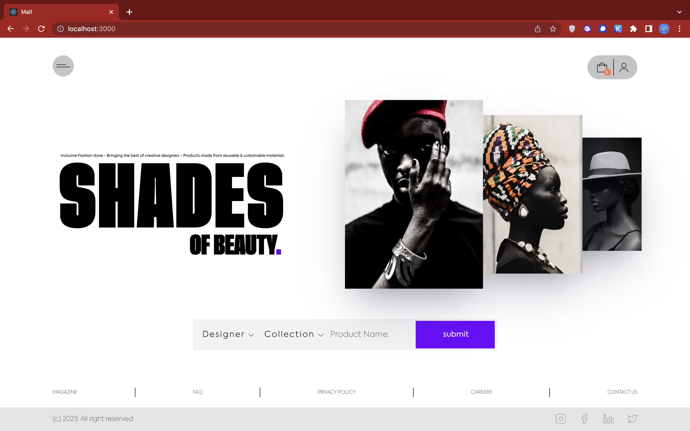
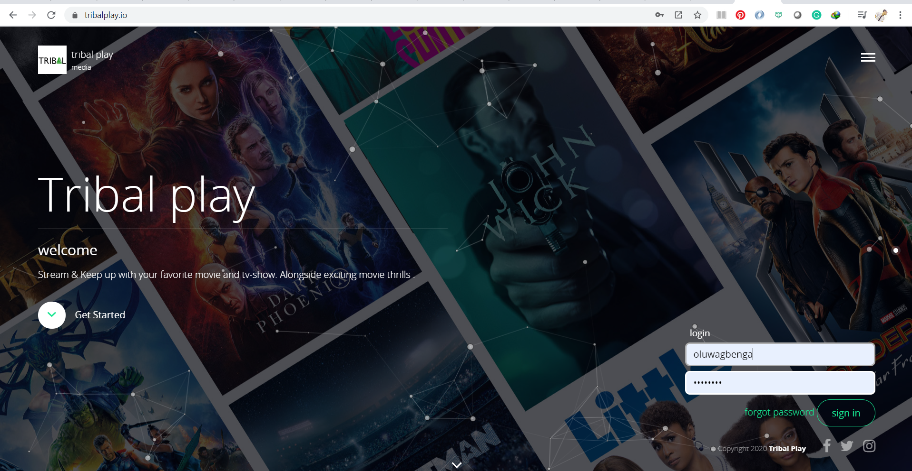

**`I'm a Fullstack Engineer with DevOps Skill's 😎`**

 
<h3>About me 👷🏾</h3>

**I'm a Creative Engineer 🤩✨  with a comprehensive knowledge of the software development lifecycle, and expertise in ideating, designing, building, and maintaining software solutions**.
 
  
Having been in cahoots with a handful of successful start-ups, a couple of established companies, personal projects & development, relative academic course loads, and a continuous learning process has helped me grasp and fall deeply in love 😍 with software engineering and how best to evolve and orchestrate Software Development processes.
   
  
  Thereby equipping me with the skillsets of engineering ideas into scalable products, maintaing and contributing to existing product. with the following breakdown.
  
1. The ability to design & architect large scalable apps using a collection of microservices.
2. Technical Know how to Deploy manage and maintain a multi-service app to the cloud via Docker and Kubernetes.
3. The ability to solve concurrency issues in a distributed systems environment.
4. Building a Server-Side Rendered App to render data from microservices.
5. Write comprehensive tests to ensure each service works as designed.

 
 
    
<h3>Hobbies 💫</h3>

   
   - 📚 Studying (word of God, Tech, History etc..)
   - ✍🏾 Creative Writing
   - 🎮 Playing video games (FIFA, PES, COD)...
   - 🎧 Listening to music
   - 📸 Photography
   - 🍿 Watching Movies
   
   
> PREVIOUSLY  
`Microsoft Learn Student Ambassador` `GitHub Campus Expert (T)` `Ingressive Campus Ambassador`
 

> CURRENTLY  
`SWE` `AWS Community Builder` `Community Manager WA Learn` `Mentor SCA` `Contributor AWGFF ` 
 

 
   

       
       
      
      

 

## Active Technologies 👨🏽‍💻

 
 

### Timeline 🚶🏾
 

| Year               | Technology Progression                                    |     Job Progression                  |
| ------------------ | --------------------------------------------------------- |--------------------------------------|
| 2023.              | Mastery of active stack                                   |  `Software Engineer (Fullstack)`     | 
| 2022               |     |    `Software Engineer (Fullstack)`   |
| 2021               |            | `Software Engineer (Fullstack)`  |
| 2020               |        |   `Software Engineer (Fullstack)`                                   |
| 2019               |              |    `Software Engineer (Fullstack)`                                     |
| 17/18               |                                                                   |   `Software Engineer (Frontend)`                    |

 
 
 

## Featured Projects

<table>
  <tr>
    <td> <a>shopping mall</a></td>
    <td> <a>streaming app</a></td>
        <td>  <a>news agency</a></td>
  </tr>
</table>

 

## Recent Blog Posts

 <table><tr><td valign="top" width="50%">

## Recent Hashnode Articles   
 
<!-- HASHNODE-BLOG-LIST:START -->
<!-- HASHNODE-BLOG-LIST:END -->
 
</td><td valign="top" width="50%">

## Recent DEV.to Articles 
 <!-- DEVTO-BLOG-LIST:START -->
- [Multiple Pointers](https://dev.to/clouded_knight/multiple-pointers-592h)
- [Frequency Counter](https://dev.to/clouded_knight/frequency-counter-hl0)
- [Problem solving Patterns](https://dev.to/clouded_knight/problem-solving-patterns-2iib)
- [Algorithm &amp; Data Structure](https://dev.to/clouded_knight/algorithm-data-structure-59e0)
- [React-Redux at it&#39;s Simplest!](https://dev.to/clouded_knight/react-redux-at-its-simplest-2kep)
<!-- DEVTO-BLOG-LIST:END -->

</td></tr></table>

-----

  
     
      <h6>Gbenga Fagbola <a href="https://linkedin.com/in/gbengafagbola">(c) 2023 </a></h6>    

